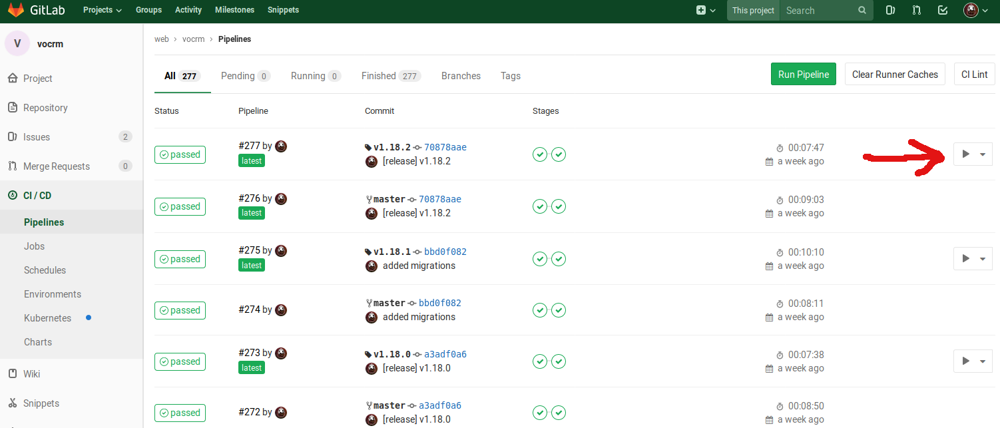

------
Деплой
------

Локальный запуск
----------------

Для локального запуска crm необходимо два репозитория:

  - `vocrm <https://gitlab.sobsam.com/web/vocrm>`_
    Тут содержится исходный код самой crm системы
  - `vocrm-compose <https://gitlab.sobsam.com/web/vocrm-compose>`_
    Тут содержится код для разворачивания инфраструктуры crm системы

Запуск
----------------

Скачиваем **vocrm-compose**

.. code-block:: bash

    cd $HOME/codefolder/
    git clone git@gitlab.sobsam.com:web/vocrm-compose.git

Скачиваем **vocrm**. Обратите внимание — команда `git clone ...` делается в папке с vocrm-compose из предыдущего шага

.. code-block:: bash

    cd $HOME/codefolder/vocrm-compose/
    git clone git@gitlab.sobsam.com:web/vocrm.git crm

Полученая структура папок

.. code-block:: bash

    cd $HOME/codefolder/
    tree -L 1 -d vocrm-compose

.. code-block:: bash

    vocrm-compose
    ├── compose
    └── crm

    2 directories

Выкатка на тестовый сервер
--------------------------

На тестовый сервер новая версия автоматически выкатывается при каждом пуше в master.

Выкатка на production
---------------------

На production сервер выкатка происходит в полуавтоматическом режиме. Для этого необходимо:

- создать git тег

.. code-block:: bash

    git tag vX.Y.Z

- запушить тег в gitlab репозиторий

.. code-block:: bash

    git push --tags

- перейти на страницу https://gitlab.sobsam.com/web/vocrm/pipelines
- дождаться когда образ соберется
- нажать кнопку для выкатки образа на прод

